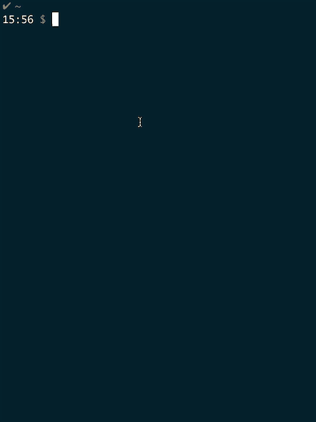

# zkcli

[](https://travis-ci.org/let-us-go/zkcli)
[](https://goreportcard.com/report/github.com/let-us-go/zkcli)

A interactive Zookeeper client.

## Install

### Mac (Homebrew)

```
brew tap let-us-go/zkcli
brew install zkcli
```

### go install

```
go install github.com/let-us-go/zkcli
```

### Build

```
make release
```

Or [download a pre-built binary](https://github.com/let-us-go/zkcli/releases) for Linux or macOS/OSX.


## Usage




```shell
$ zkcli ls /test
[abc]
```

```shell
$ zkcli
>>> 
>>> help
get <path>
ls <path>
create <path> [<data>]
set <path> [<data>]
delete <path>
connect <host:port>
addauth <scheme> <auth>
close
exit
>>>
```
